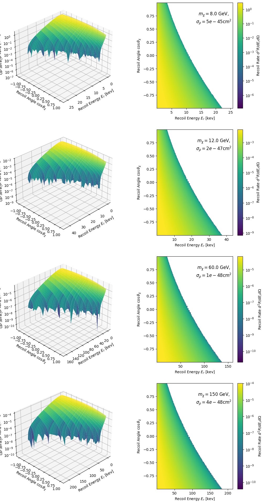
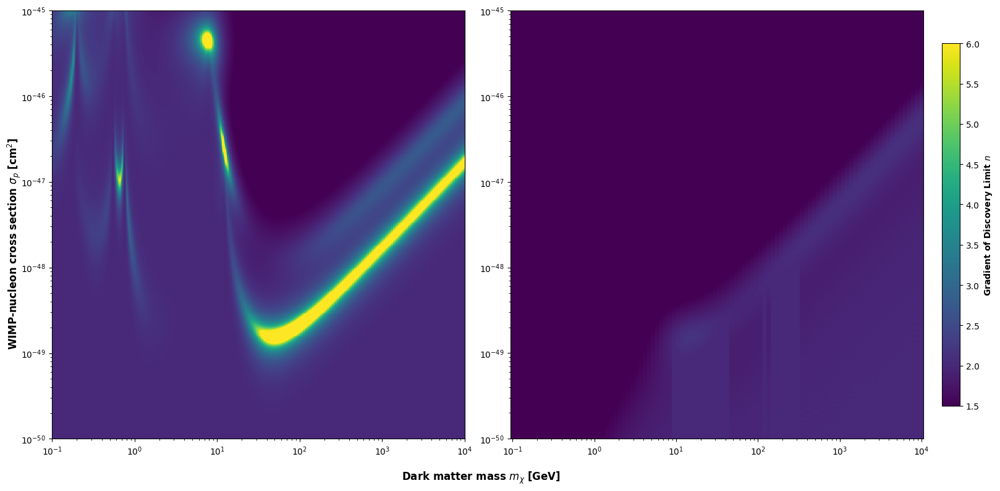

# Overcoming the Neutrino Fog with Directional Detectors

Computational implementation of directional WIMP and neutrino recoil rate calculations, developed as part of an Honours thesis at the University of Sydney (2024), supervised by Dr C. A. J. O'Hare.

As direct dark matter detectors become increasingly sensitive, an irreducible background emerges from Coherent Elastic Neutrino-Nucleus Scattering (CEvNS) — known as the neutrino fog. This project implements directional recoil rate calculations to demonstrate that a directional detector can distinguish WIMP signals from this background in regimes where conventional energy-only detectors cannot.

---

## Project Structure
```
├── notebooks/          # Jupyter notebooks (run in order 1-5)
├── src/dirdet/         # Source functions — recoil rates, velocity distributions, neutrino fog, plotting utilities
│   └── config/         # Physical constants, unit conversions, detector target definitions
├── figures/            # Output figures organised by notebook
├── input_data/         # Neutrino flux data files and directional pixel data
└── nu_fog_data/        # Precomputed neutrino fog values (loaded by default in notebook 5)
```

---

## Notebooks

### 1. Neutrino Recoil Rate (Non-Directional)
Plots of neutrino flux and CEvNS recoil rate as a function of recoil energy, categorised across four neutrino families: pp-neutrinos, CNO neutrinos, pep neutrinos (discrete), and isotropic backgrounds (DSNB and ATM).

### 2. WIMP Recoil Rate (Non-Directional)
WIMP recoil rate as a function of energy across varying WIMP mass and nucleon cross-section parameters. Includes:
- Overlay of WIMP and neutrino recoil rates with WIMP parameters estimated via basin hopping
- Surface and colour plots of expected events as a function of WIMP mass and cross-section

### 3. Directional Neutrino Recoil Rate
Implementation of the directional CEvNS recoil rate framework. Theory covers the kinematic constraint, directional cross-section, recoil rate differences for isotropic, monoenergetic and continuous neutrino sources, and the definition of cos(θ_sun). Includes:
- Directional recoil rate as a function of energy for multiple cos(θ_sun) values
- Angle-integrated directional recoil rate as a function of cos(θ_sun)
- Surface and colour plots of the directional recoil rate as a function of energy and angle for all neutrino families

### 4. Directional WIMP Recoil Rate
Implementation of the directional WIMP recoil rate via the Radon Transform of the Standard Halo Model velocity distribution. Theory covers the Radon Transform, directional WIMP recoil rate, and the definition of cos(θ_χ). Includes:
- Surface and colour plots of the directional recoil rate as a function of energy and angle across four WIMP mass and cross-section configurations

### 5. Neutrino Fog
Generation of the standard and directional Neutrino Fog. The fog calculation is computationally intensive — precomputed values are provided in `nu_fog_data/` and loaded by default. The full calculation can be run directly from the notebook if desired.

---

## Results
Directional recoil rate of WIMPs as a function of recoil energy and angle $\cos{\theta_{\chi}}$, shown for four WIMP mass and cross-section configurations. The strong asymmetry towards $\cos{\theta_{\chi}} = -1$ reflects the directional signature of the galactic WIMP wind.


Comparison of the standard (non-directional) and directional Neutrino Fog. The directional fog boundary is pushed to lower cross-sections, demonstrating that directional detection extends experimental sensitivity into regimes inaccessible to conventional detectors.


---

## Dependencies
```
numpy
matplotlib
scipy
tqdm
```

Install via:
```bash
pip install numpy matplotlib scipy tqdm
```

---

## Usage

Install dependencies:
```bash
pip install numpy matplotlib scipy tqdm
```

Open notebooks in order using Jupyter:
```bash
jupyter notebook
```

Source functions are imported from `src/dirdet`. Physical constants, unit conversions, and detector target definitions are in `src/dirdet/config/`. Notebooks contain inline theory notes and derivations providing context for the calculations.

---

## Background

Based on Honours thesis submitted to the University of Sydney (2024), supervised by Dr C. A. J. O'Hare. Mathematical derivations follow established literature in WIMP direct detection and directional detection methodology. The Standard Halo Model is used to characterise the dark matter velocity distribution, assuming a smooth isothermal sphere with a Gaussian velocity distribution truncated at the galactic escape speed. The original analysis was restructured into a modular Python project with clean separation of source functions, configuration, and input data, and extended with additional visualisations including surface plots of directional recoil rates.

---

## Acknowledgements

Foundational code for non-directional WIMP and CEvNS recoil rates and the Neutrino Fog framework was provided by Dr C. A. J. O'Hare. My independent contribution is the directional recoil rate implementations (WIMP and CEvNS) and the extension of the Neutrino Fog framework to incorporate directional event rates, producing the Directional Neutrino Fog

---

## License

MIT License